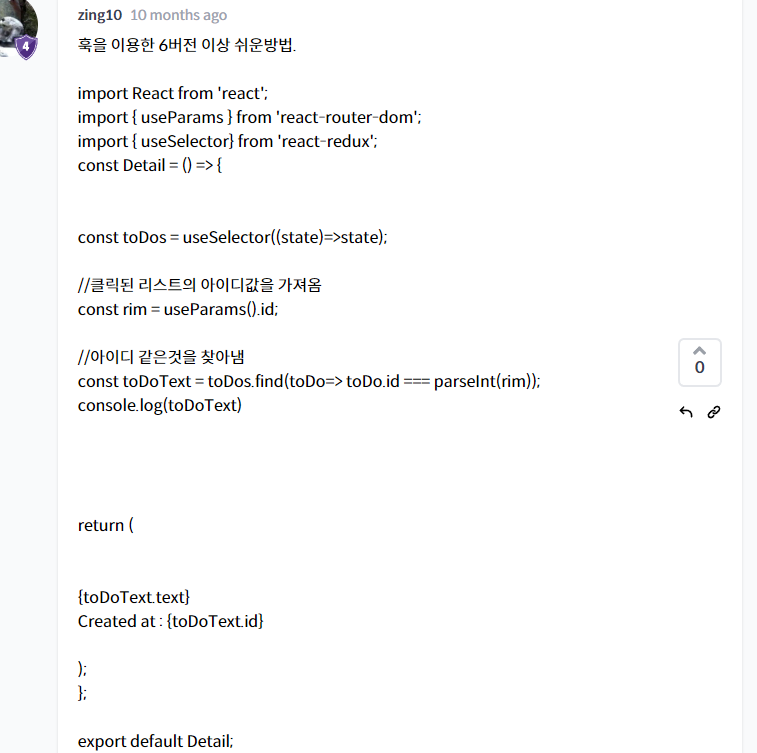
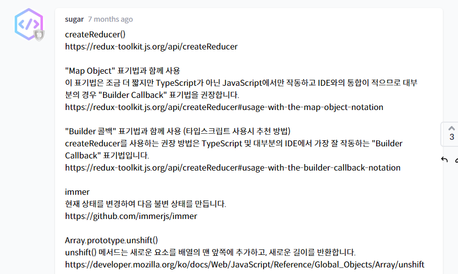

````react
connect()
connect는 여전히 작동하며 React-Redux 8.x에서 지원됩니다. 그러나 기본적으로 hooks API를 사용하는 것이 좋습니다.
https://react-redux.js.org/api/connect

useSelector()
selector함수를 사용하여 Redux store state의 데이터를 가져올 수 있습니다.
ex) useSelector(selector: Function, equalityFn?: Function)
```
// useSelector를 통해 store의 state를 바로 가져옴
const todo=useSelector((state)=>state);
```
https://react-redux.js.org/api/hooks#useselector
````


```react
const Home = () => {
const [text, setText] = useState("");
const onChange = (event) => {
setText(event.target.value);
};
const toDo = useSelector(state => state);
const dispatch = useDispatch();
const onSubmit = (event) => {
event.preventDefault();
dispatch(addToDo(text));
setText("");
}
};

return에서 map 돌리실 때는 영상의 todos가 아니라 useSelector로 가져온 toDo를 사용하시면 됩니다.
```




***

## redux-toolkit

### createAction


- 기존코드 확 줄음


- 데이터들이 이제 payload에 다 들어가있게 된다

### createReducer



```react
createReducer()
https://redux-toolkit.js.org/api/createReducer

"Map Object" 표기법과 함께 사용​
이 표기법은 조금 더 짧지만 TypeScript가 아닌 JavaScript에서만 작동하고 IDE와의 통합이 적으므로 대부분의 경우 "Builder Callback" 표기법을 권장합니다.
https://redux-toolkit.js.org/api/createReducer#usage-with-the-map-object-notation

"Builder 콜백" 표기법과 함께 사용 (타입스크립트 사용시 추천 방법)
createReducer를 사용하는 권장 방법은 TypeScript 및 대부분의 IDE에서 가장 잘 작동하는 "Builder Callback" 표기법입니다.
https://redux-toolkit.js.org/api/createReducer#usage-with-the-builder-callback-notation

immer
현재 상태를 변경하여 다음 불변 상태를 만듭니다.
https://github.com/immerjs/immer

Array.prototype.unshift()
unshift() 메서드는 새로운 요소를 배열의 맨 앞쪽에 추가하고, 새로운 길이를 반환합니다.
https://developer.mozilla.org/ko/docs/Web/JavaScript/Reference/Global_Objects/Array/unshift
```


- 이건 map object표기법인데 나는 아래의 builder callback 표기법(TS 가능)써야함

```typescript
import {
  createAction,
  createReducer,
  AnyAction,
  PayloadAction,
} from '@reduxjs/toolkit'

const increment = createAction<number>('increment')
const decrement = createAction<number>('decrement')

function isActionWithNumberPayload(
  action: AnyAction
): action is PayloadAction<number> {
  return typeof action.payload === 'number'
}

const reducer = createReducer(
  {
    counter: 0,
    sumOfNumberPayloads: 0,
    unhandledActions: 0,
  },
  (builder) => {
    builder
      .addCase(increment, (state, action) => {
        // action is inferred correctly here
        state.counter += action.payload
      })
      // You can chain calls, or have separate `builder.addCase()` lines each time
      .addCase(decrement, (state, action) => {
        state.counter -= action.payload
      })
      // You can apply a "matcher function" to incoming actions
      .addMatcher(isActionWithNumberPayload, (state, action) => {})
      // and provide a default case if no other handlers matched
      .addDefaultCase((state, action) => {})
  }
)
```

```react
2023.01.19 기준 강의처럼 진행하면
The object notation for `createReducer` is deprecated, and will be removed in RTK 2.0. Please use the 'builder callback' notation instead: https://redux-toolkit.js.org/api/createReducer 이라는 경고 문구가 뜹니다.

const reducer = createReducer([], (builder) => {
builder
.addCase(addTodo, (state, action) => {
state.push({ id: createTodoId(), text: action.payload });
})
.addCase(deleteTodo, (state, action) => {
return state.filter((toDo) => toDo.id !== action.payload);
});
});

reference : https://redux-toolkit.js.org/api/createreducer
```

```react
builder callback code로 정의한 createReducer

const STORE = "store";

export const getAddAction = createAction("ADD");
export const getDeleteAction = createAction("DELETE");

const getItem = () => JSON.parse(storage.getItem(STORE));
const setItem = (item) => storage.setItem(STORE, JSON.stringify(item));

const reducer = createReducer([], (builder) => {
builder
.addCase(getAddAction, (state, { type, payload }) => {
setItem([{ id: Date.now(), text: payload }, ...state]);
return getItem();
})
.addCase(getDeleteAction, (state, { type, payload }) => {
setItem(state.filter(({ id }) => id !== payload));
return getItem();
})
.addDefaultCase(() => getItem());
});

```

### configureStore


### createSlice


- 코드 엄청 짧아짐..
- action과 reducer가 한번에 들어감
- reducer도 createSlice가 주는걸로 재설정하고 (toDos.reducer)로
- 맨 마지막 toDos.actions에 action도 담겨있어서 export가능


### 두개이상 reducer

