📌 Types of TS(기본)
✅ 배열: 자료형[]
✅ 숫자: number
✅ 문자열: string
✅ 논리: boolean
✅ optional
const player : {
  name: string,
  age?:number
} = {
  name: "nico"
}

❌ player.age가 undefined일 가능성 알림
if(player.age < 10) {
}

⭕ player.age가 undefined일 가능성 체크
if(player.age && player.age < 10) {
}

❗ ?를 :앞에 붙이면 optional

✅ Alias(별칭) 타입
type Player = {
  name: string,
  age?:number
}

const player : Player = {
  name: "nico"
}

⭐ 함수에서는 어떻게 쓸까
type Player = {
  name: string,
  age?:number
}

function playerMaker1(name:string) : Player {
  return {
    name
  }
}

const playerMaker2 = (name:string) : Player => ({name})

const nico = playerMaker1("nico")
nico.age = 12

***

📌 Types of TS(part II)
✅ readonly 사용하기
type Player = {
  readonly name:string
  age?:number
}

const playerMaker = (name: string): Player => ({name})

const nico = playerMaker("nico")
🚫 nico.name = "aa"

const numbers: readonly number[] = [1, 2, 3, 4]
🚫 numbers.push(1)
❗ readonly가 있으면 최초 선언 후 수정 불가
  ⇒ immutability(불변성) 부여
    but, javascript에서는 그냥 배열

✅ Tuple
정해진 개수와 순서에 따라 배열 선언
const player: [string, number, boolean] = ["nico", 1, true]
❗ readonly도 사용가능 ⇒ readonly [...] 형태

✅ undefined, null, any
any: 아무 타입
undefined: 선언X 할당X
null: 선언O 할당X

📌 Types of TS(part II)
✅ unknown
let a:unknown

if(typeof a === 'number'){
  let b = a + 1
}
if(typeof a === 'string'){
  let b = a.toUpperCase()
}
🚫 let b = a + 1

✅ void
아무것도 return하지 않는 함수에서 반환 자료형
function hello() {
  console.log('x')
}
const a = hello()
🚫 a.toUpperCase()

✅ never
함수가 return하지 않을 때
function hello():never {
  throw new Error("zzz")
  🚫return "a"
}

function temp(name:string|number):never {
  if(typeof name === "string"){
    name
  } else if(typeof name === "number"){
    name
  } else {
    name
  }
}

if 안에서는 string형의 name 반환
else if 안에서는 number형의 name 반환
else 안에서는 never형의 name 반환
⇒ 즉, 제대로 인자가 전달되었다면 else로 올 수 없음

function hello2(a: unknown) {
a.b(); // 에러: Object is of type 'unknown'.
}
\```
never
일부 함수는 값을 반환하지 않습니다.
이는 함수가 예외를 throw하거나 프로그램 실행을 종료함을 의미합니다.
\```
function fail(msg: string): never {
throw new Error(msg);
}
\```

***

``` 5:26 에서 {}를 사용했을 때 오류가 발생하는 이유가 기억이 안 나서 다시 찾아봤습니다.
5:26 에서 {}를 사용했을 때 오류가 발생하는 이유가 기억이 안 나서 다시 찾아봤습니다.
결론부터 말씀드리자면 {}를 사용하면 그 값이 반환값이 함수 내부의 내용으로 처리가 됩니다.

밑의 예시를 보면 이해가 되실거라 생각됩니다.
\1. const add:Add = (a,b) => a+b 를 함수로 풀면 다음과 같게 됩니다.
function add(a, b) {
return (a+b)
}

\2. const add:Add = (a,b) => {a+b} 를 함수로 풀면 다음과 같게 됩니다.
function add(a, b) {
a+b;
}

즉 애로우함수에서 {}를 사용하게 되면 그 안의 값은 반환이 아니라 함수 내부 내용으로 처리되기에 반환값이 없는 void로 처리됩니다. 이에 따라 위에서 미리 선안한 Add자료형의 반환값은 number라고정해놓은 내용과 충돌하기에 에러가 발생합니다.

저도 공부하는 입장에서 정리한거라 오류가 있을 수 있습니다. 오류수정은 언제나 환영합니다 :)
```

Function(=Method) Overloading은 직접 작성하기보다 외부 라이브러리에 자주 보이는 형태로, 하나의 함수가 복수의 Call Signature를 가질 때 발생한다

type Add = {
(a: number, b: number): number,
(a: number, b: string): number
}

const add: Add = (a, b) => {
if (typeof b === "string") return a;
return a + b;
}

매개변수의 데이터 타입이 다른 경우 예외 처리

type Add2 = {
(a: number, b: number): number,
(a: number, b: number, c: number): number
}

const add2: Add2 = (a, b, c?: number) => {
if (c) return a + b + c;
return a + b;
}

매개변수의 수가 다른 경우 예외 처리

위와 같은 함수는 거의 없지만 외부 라이브러리에서 활용될 수 있다

router.push("/home");

router.push({
path: "/home",
state: 1
});

예를 들어, Next.js의 라우터 push가 대충 두 가지 방법으로 페이지를 이동한다고 할 때,

type Config = {
path: string,
state: number
}

type Push = {
(config: Config): void,
(config: string): void
}

const push: Push = (config) => {
if (typeof config === "string") console.log(config);
else console.log(config.path);
}

패키지나 라이브러리는 위와 같이 두 가지 경우의 Overloading으로 디자인되어 있을 것이다

***

polymorphism
인자들과 반환값에 대하여 형태(타입)에 따라 그에 상응하는 형태(타입)를 갖을 수 있다.

any와의 차이점은 해당 타입에 대한 정보를 잃지 않는다.
any는 any로서 밖에 알 수 없지만 generics는 타입 정보를 알 수 있다.

─ 예시 ────────────────────────
type SuperPrint = { (arr: T[]): void }
type SuperReturn = { (arr: T[]): T }

const superPrint: SuperPrint = (arr) => {
  arr.forEach(i => console.log(i))
}
const superReturn: SuperReturn = (arr) => arr[0]

superPrint([1, 2, false, true])
console.log(superReturn([1, 2, 3, 4]))

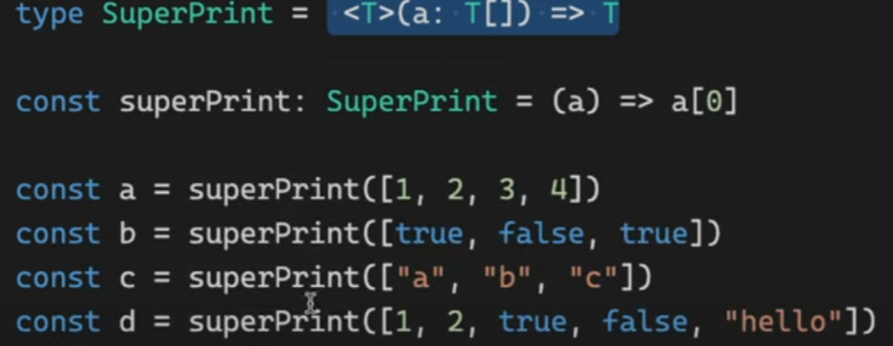

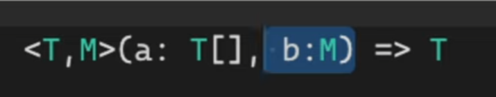

**강의 보면서 느낌은 알았지만 제네릭 개념을 한마디로 설명하는 게 힘들었는데 인터넷에서 본 설명이 인상 깊어서 옮겨봅니다.**

**'제네릭은 선언 시점이 아니라 생성 시점에 타입을 명시하여 하나의 타입만이 아닌 다양한 타입을 사용할 수 있도록 하는 기법이다.'**

https://velog.io/@edie_ko/TypeScript-Generic-%EC%A0%9C%EB%84%A4%EB%A6%AD-feat.-TypeScript-%EB%91%90-%EB%8B%AC%EC%B0%A8-%ED%9B%84%EA%B8%B0

- https://developer-talk.tistory.com/195

***

### Classes

Classes

추상(abstract) 클래스
추상 클래스는 오직 다른 클래스가 상속받을 수 있는 클래스이다.
하지만 직접 새로운 인스턴스를 만들 수는 없다.
```typescript
abstract class User{
    constructor(
        private firstname:string,
        private lastname:string,
        public nickname:string
    ){
    abstract getNickname():void
	}
}

class Player extends User{
// 추상 메서드는 추상 클래스를 상속받는 클래스들이 반드시 구현(implement)해야하는 메서드이다.
	getNickname(){
	console.log(this.nickname)
	}
}

```


public: 모든 클래스에서 접근 가능
private: 해당 클래스 내에서만 접근 가능 (자식 클래스에서도 접근 불가)
protected: 해당 클래스와 자식 클래스에서 접근 가능

https://www.typescriptlang.org/docs/handbook/2/classes.html

📌접근 가능한 위치

구분　　　선언한 클래스 내　상속받은 클래스 내　인스턴스
private 　 　　　⭕　　　　　　　❌　　　　　❌
protected 　　　⭕　　　　　　　⭕　　　　　❌
public　　　　　⭕　　　　　　　⭕　　　　　⭕

***

## Class 추가공부

```typescript
type Words = {
    [key: string]: string
}

// 위의 key값에 대한 예시 key도 string으로 써야함
// let dict : Words = {
//     "potato" : "foods",
//     "rice": "foods",
// }


class Dicts {
    // constructor를 안에서안하고 밖에서 뺀다음 수동으로 따로 초기화해줌
    private words: Words
    constructor() {
        this.words = {}
    }
    // 놀랍게도 아래처럼 클래스자체를 타입처럼 쓸수도 있다!
    add(word: Word) {
        if (this.words[word.term] === undefined) {
            this.words[word.term] = word.def;
        } else {
            console.log("error")
        }
    }
    // term으로 def 찾기
    def(term: string) {
        return this.words[term];
    }
    // 삭제 만들어보자
    remove(word: Word) {
        const { term, def } = word
        if (this.words[term]) {
            delete this.words[term];
        } else {
            console.log("그런단어 없음");
        }
    }
    // 수정 만들어보자
    update(word: Word) {
        const { term, def } = word
        if (this.words[term]) {
            this.words[term] = def
        } else {
            console.log("그런단어 없음");
        }
    }
}

// 단어 정의
class Word {
    constructor(
        public term: string,
        public def: string,
    ) { }
    // 단어 뜻 수정 해보자
    modiDef(newdef: string) {
        this.def = newdef;
    }
    // 단어 뜻 추가 만들어보자
    addDef(newdef: string) {
        this.def = `${this.def}, ${newdef}`
    }

}

const kimchi = new Word("kimchi", "한국의 음식")
const dic = new Dicts();
dic.add(kimchi);
dic.def("kimchi");
```

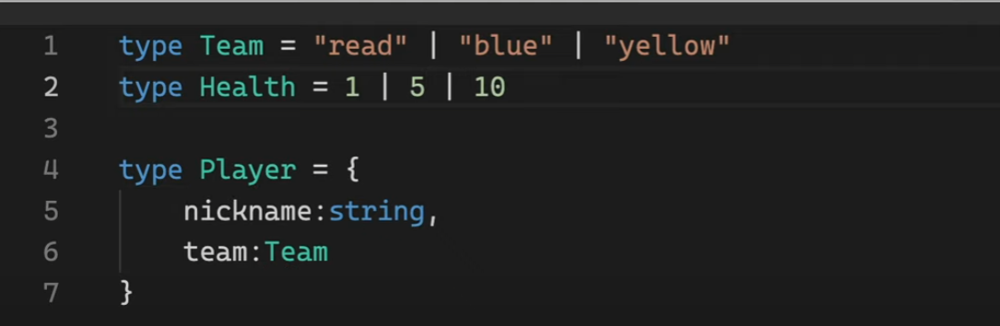

- 이렇게 타입은 특정 값을 타입으로도 쓸수가있따

Type의 용도 :
\1. 특정 값이나 객체의 값에 대한 타입을 지정해줄 수 있다.
\2. Type alias(타입에 대한 별명)를 만들어줄 수 있다.
\3. 타입을 특정한 값을 가지도록 제한할 수 있다.

Static Members
클래스에는 static 멤버가 있을 수 있습니다. 이 멤버는 클래스의 특정 인스턴스와 연결되지 않습니다. 클래스 생성자 객체 자체를 통해 액세스할 수 있습니다. static 멤버는 동일한 public, protected 및 private 과 함께 사용할 수도 있습니다.

```typescript
class MyClass {
static x = 0;
static printX() {
console.log(MyClass.x);
}
}
console.log(MyClass.x);
MyClass.printX();
```


```typescript
https://www.typescriptlang.org/docs/handbook/2/classes.html#static-members
```

Interfaces
객체의 모양을 특정해주기 위해 사용합니다. 여기서는 firstName 및 lastName 필드가 있는 객체를 설명하는 인터페이스를 사용합니다.

https://www.typescriptlang.org/docs/handbook/typescript-tooling-in-5-minutes.html#interfaces

## Interface

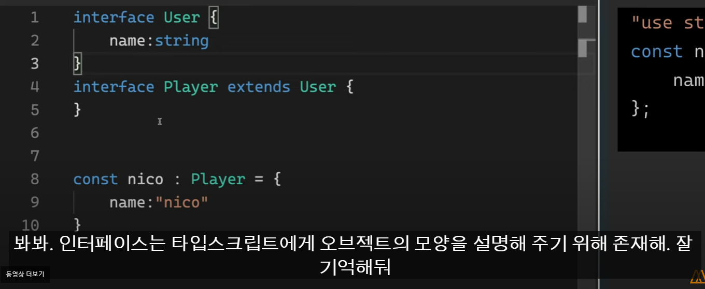

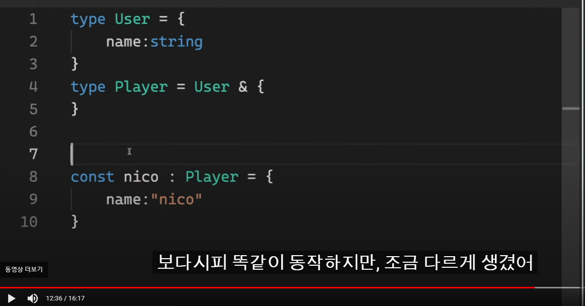

- 타입으로 상속받아서 만들면 좀 다르게 생기게됨 
- 위에가 더편하고 좋다고함
- 특히 리액트쓸려면


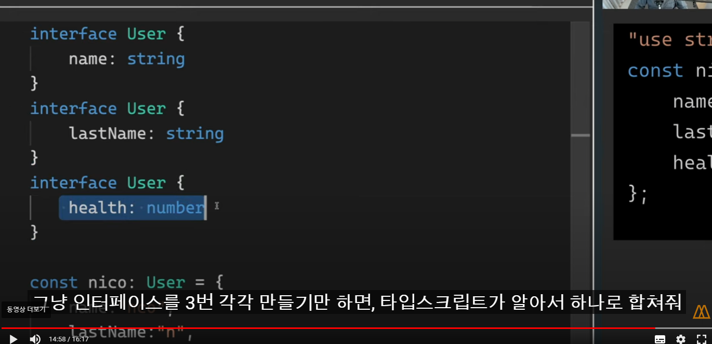

- 타입으로는 이렇게 안된다

- 즉 인터페이스는 객체지향 프로그래밍의 개념을 활용해서 디자인되었고 오브젝트에는 이게 더 낫다 

***

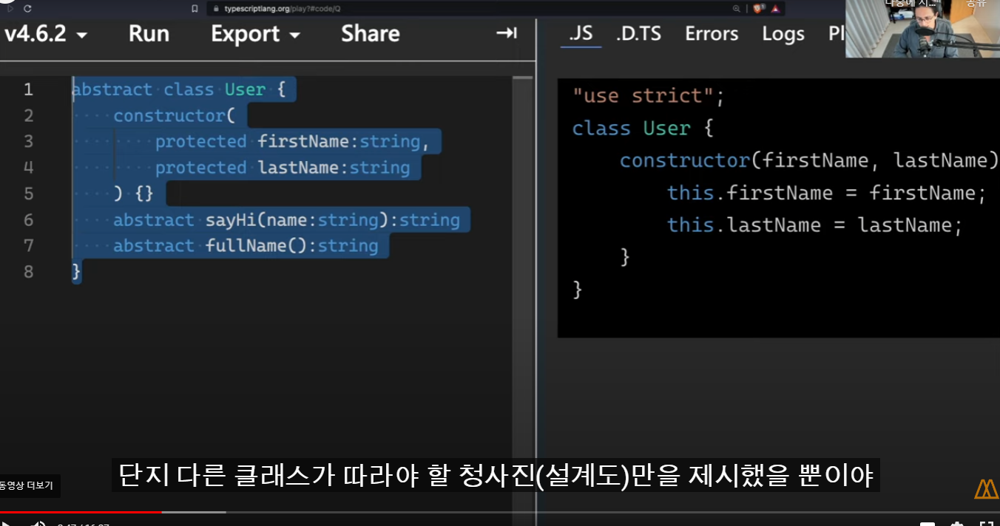

- 추상클래스 복습

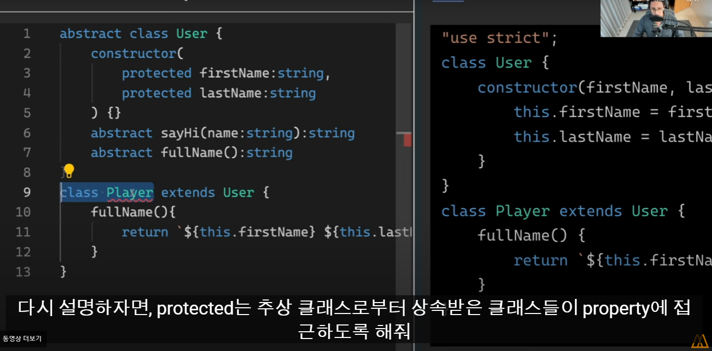

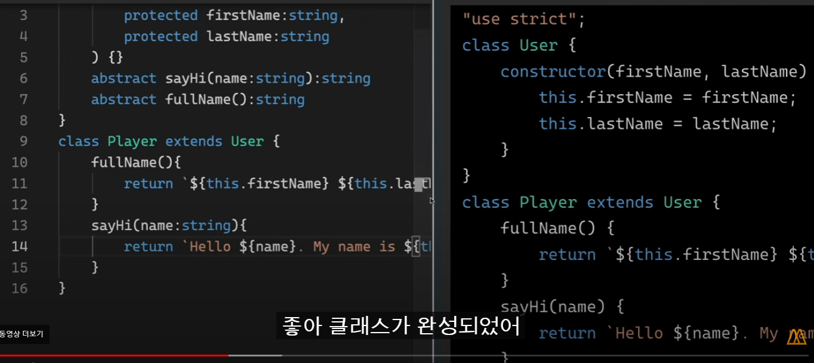

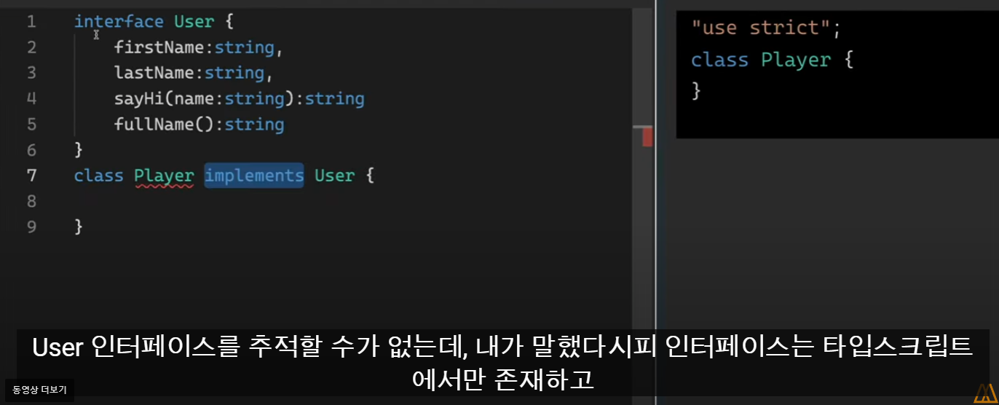

### i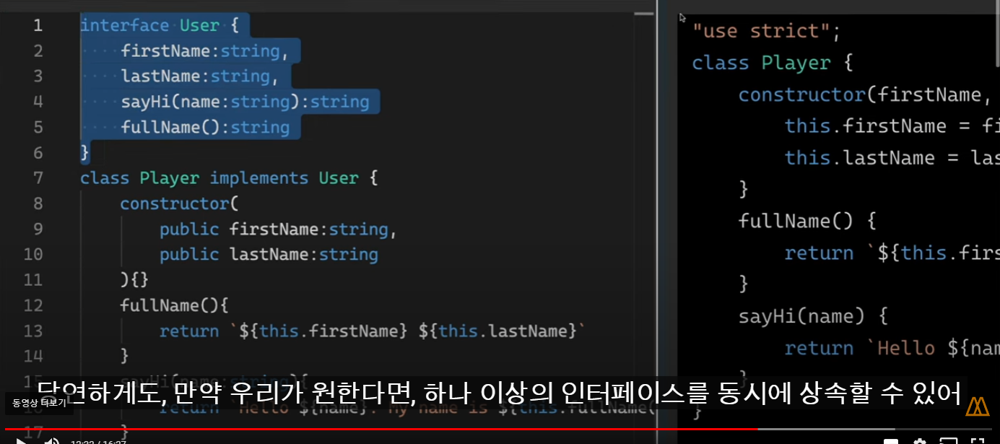

### implements

implements을 사용하여 클래스가 특정 인터페이스를 충족하는지 확인할 수 있습니다.
클래스를 올바르게 구현하지 못하면 오류가 발생합니다.
implements 절은 클래스가 인터페이스 유형으로 처리될 수 있는지 확인하는 것입니다. 클래스의 유형이나 메서드는 전혀 변경하지 않습니다.
또한 클래스는 여러 인터페이스를 구현할 수도 있습니다. 클래스 C는 A, B를 구현합니다.
ex) class C implements A, B { }

```typescript
interface Pingable {
ping(): void;
}

// Sonar클래스는 Pingable인터페이스를 implement했기 때문에 Pingable가 가진 ping메서드를 구현해줘야 합니다.
class Sonar implements Pingable {
ping() {
console.log("ping!");
}
}
```

- 오늘 복습했던 위에 완성한 추상클래스를 인터페스를 통해서 구현
  - 기존의 필요없이 JS화 되어서 구현되던 추상클래스인 User가 이제 JS에서 사라지고 가벼워짐
  - extends 대신 implements 사용
  - extends는 JS에서 쓰니까 그대로 컴파일 되었는데 implements 는 TS꺼라 컴파일 안됨

- 즉, 인터페이스는 TS에만 존재하고 실제 코드엔 보여지지않으니 대부분에는 더 좋다

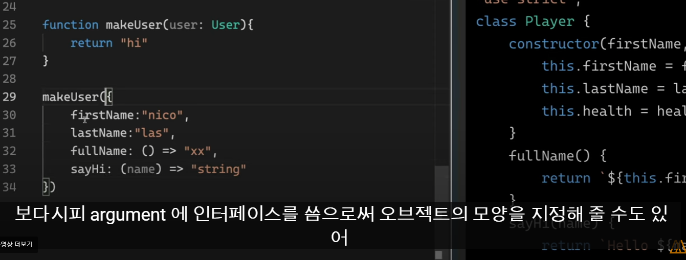

- 인터페이스도 타입처럼 쓸수가 있으니 잊지말자

***

```typescript
interface SStorage<T> {
    [key: string]: T
}

class LocalStorage<T> {
    private storage : SStorage<T> = {}
    
    set(key:string, value: T) {
        return this.storage[key] = value;
    }
    get(key:string): T {
        return this.storage[key];
    }

    delete(key:string) {
        delete this.storage[key];
    }
    clear(key:string) {
        this.storage = {};
    }

}
const newTest = new LocalStorage<string>();

newTest.set("test", "answer")
newTest.get("test")
```

```typescript

interface SStorage {
	[key:string]:T
}

class LocalStorage {
	private storage: SStorage = {}
//Create
	set(key:string, value:T){
		if(this.storage[key] !== undefined){
		return console.log(`${key}가 이미 존재합니다. update 호출 바랍니다.`)
		}
		this.storage[key] = value
		}
//Read
        get(key:string):T|void {
        if(this.storage[key] === undefined){
        return console.log(`${key}가 존재하지 않습니다.`)
        }
        return this.storage[key]
        }
//Update
        update(key:string, value:T){
        if(this.storage[key] !== undefined){
        this.storage[key] = value
        } else {
        console.log(`${key}가 존재하지 않아 새로 만듭니다.`)
        this.storage[key] = value
        }
        }
//Delete
        remove(key:string){
        if(this.storage[key] === undefined){
        return console.log(`${key}가 존재하지 않습니다.`)
        }
        delete this.storage[key]
        }
//Clear
        clear(){
        this.storage = {}
        }
        }
```

***

## Typescript 프로젝트 만들어보기

```typ
typescript설치
npm i -D typescript

package.json 초기화
npm init -y

tsconfig.json설정
디렉터리에 tsconfig.json 파일이 있으면 해당 디렉터리가 TypeScript 프로젝트의 루트임을 나타냅니다. tsconfig.json 파일은 프로젝트를 컴파일하는 데 필요한 루트 파일과 컴파일러 옵션을 지정합니다.
https://www.typescriptlang.org/docs/handbook/tsconfig-json.html#handbook-content

Target (기본값: ES3)
최신 브라우저는 모든 ES6 기능을 지원하므로 ES6는 좋은 선택입니다. 코드가 이전 환경에 배포된 경우 더 낮은 target을 설정하거나 최신 환경에서 코드 실행이 보장되는 경우 더 높은 target을 설정하도록 선택할 수 있습니다.
ex) 화살표 함수() => this는 ES5 이하이면 함수 표현식으로 바뀝니다.

특별한 ESNext 값은 TypeScript 버전이 지원하는 가장 높은 버전을 나타냅니다. 이 설정은 다른 TypeScript 버전 간에 동일한 의미가 아니며 업그레이드를 예측하기 어렵게 만들 수 있으므로 주의해서 사용해야 합니다.
https://www.typescriptlang.org/tsconfig#target

"build": "tsc" 또는 "npx tsc"
```

